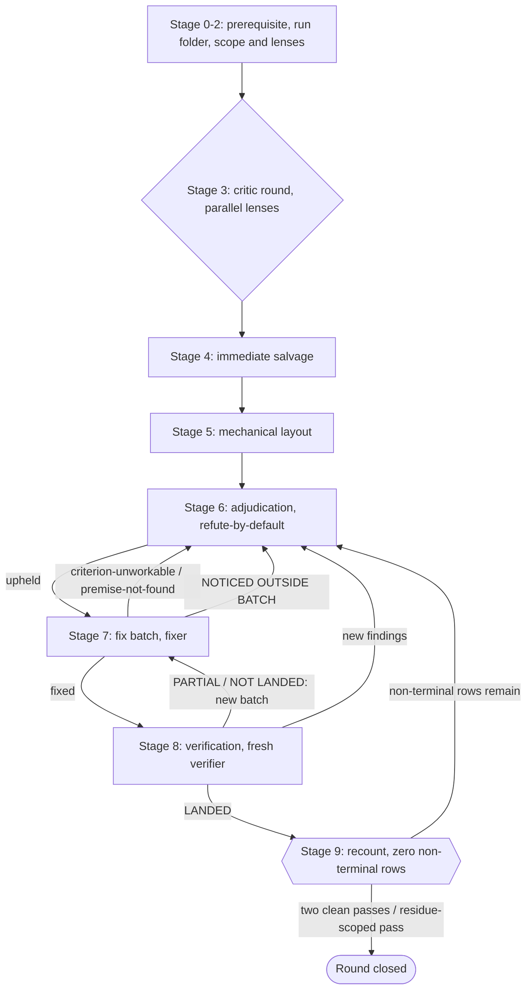

# critic-ledger

[](https://github.com/Spoloborota/critic-ledger/actions/workflows/tests.yml) [](LICENSE) [](pyproject.toml)

Critics find real defects; the loss is what happens next. Findings get "fixed on
the spot" from a summary, a large share of the fixes never fully land, and
nothing in the process notices — so the following round re-finds what was
supposedly repaired, and the word "fixed" stops carrying information.

This plugin packages one discipline against that, for teams running
agent-applied fixes — anyone whose critics' findings must actually land.

- A **round** sends parallel read-only critics at the object under separate
  lenses, judges their findings refute-by-default, hands the upheld ones to a
  separate fixer in small batches, and lets a fresh verifier re-derive every
  claimed fix.
- A **fix-ledger** keeps one row per finding, and the round ends only when a
  script confirms no row is left open.

**It is an expensive procedure** — a round spawns several agents and reads the
object whole, so it runs on an explicit request and never starts itself. The
discipline is held to its own rule: it changes only through a critic round run
on the proposed change.



The stage machine collapsed to its product-facing shape — the ten stages are
indexed in `skills/critic-ledger/SKILL.md`'s Stage machine section, and the
retry conditions drawn above are normative in that skill's
`references/stage-7-fix-batches.md`, `references/stage-8-verification.md` and
`references/stage-9-closure.md`.

## A worked example

Three rows from sanitized real rounds run on this repository: a blocker that was
fixed, a finding that was refuted, and — kept visible rather than quietly
dropped — a residue the owner signed off on instead of fixing. Field values are
quoted from the ledger, trimmed where `…` marks it; the full ledger — with its
verification-pass table and column-by-column legend — is in
[`examples/worked-round/`](examples/worked-round/); read
[how to read it](examples/worked-round/README.md) first.

### DA-2 · blocker → `verified-landed`

> **Claim:** The closure script did not parse every row it was given: a row with
> a stray pipe … was skipped without a word … the script still announced the
> round closable …
>
> **Verdict:** confirmed; reproduced on a fixture whose single damaged row
> disappeared from the count while the exit code stayed 0.
>
> **Criterion:** L1 command and exit code — a fixture ledger carrying one
> unparsable row makes the script exit 2 and print that line's number …
>
> **Fix:** `a1b2c3d` — **verified:** LANDED (V1).

### HB-3 · major → `refuted-with-reason`

> **Claim:** The document was said to have grown two rules … that appeared in
> none of the design notes behind it … normative content nobody sanctioned.
>
> **Verdict:** refuted with command evidence: reading the file as it stood
> before the rewrite showed both rules already present …
>
> **Criterion:** —
>
> **Fix:** — a refuted finding ends at its verdict.

### DC-1 · major → `accepted-residue` (user-signed 2026-08-06)

> **Claim:** The evidence figures quoted in the public text form a fingerprint …
>
> **Verdict:** confirmed as a class of risk … the link back to the author is
> INTENDED … the figures carry the evidence a reader needs …
>
> **Criterion:** L2 deterministic structural check … (upheld criterion,
> deliberately left unsatisfied).
>
> **Fix:** no fix — owner decision on the published figures; the row is residue,
> not a landing (attribution is intended; re-signed by the owner).

Live `recount.py` output over that ledger, captured from a real run rather
than written as an illustration. Reproduce it from
[`examples/worked-round/`](examples/worked-round/) with
`python3 ../../skills/critic-ledger/scripts/recount.py fix-ledger.md`:

```text
rows: 12 | terminal: 12 | non-terminal: 0
severity distribution (terminal/rows): blocker 1/1 | major 8/8 | minor 3/3
upheld/refuted: 11 upheld, 1 refuted
residual-defect ESTIMATE (Jackknife capture-recapture): N-hat 14.0 | D 8 raised | f1 8 single-lens | k 4 (HA, HB, HC, HD)
  ESTIMATE is ADVISORY, reported and never acted on: it enters no stop rule and no exit code. Lens diversity does not invalidate it (the source measured little or no impact on the estimate), but the caution that remains is OURS and is named as ours: our four field measurements put the single-lens share at 75-94% and N-hat near 2*D, and they count D as distinct CONFIRMED findings where this line counts distinct RAISED ones, so comparability is not established. Treat the number as advice, not as a target.
new-findings curve: 1 -> 1 -> 0
  time axis: n/a (no started/ended columns — v1 passes table)
stop criterion (verdict streak): met — passes 2, 3 both clean (0 NOT LANDED, 0 new major/blocker findings)
ROUND CLOSABLE: zero non-terminal rows.
```

## What this is built on

The discipline was not designed from theory; it was derived from watching
remediation fail. Findings fixed in bulk from a critic's summary came back
partly applied or not applied at all, nothing in the process noticed, and
the following round re-found them. What stopped that was itemizing each
finding with its own address and readiness criterion, handing the batch to a
separate fixer, and letting a fresh verifier re-derive every claimed fix
instead of reading the fixer's report. Every rule here is paired with the
defect that forced it.

A round runs under a PROFILE — F, M or L, assigned at adjudication from the
number of confirmed findings or fixed in the contract — which sets how many
verification passes and how fine the fix batches are, and nothing else.

**There is no external benchmark for any of this, and none is claimed.** No
controlled comparison against a baseline, no outside arbiter, no efficacy
figure in this README. Collecting that evidence is planned, not done: the
only instrument shipped is the optional OpenTelemetry receiver (see
[Privacy](#privacy)), the measurement itself has not been taken, and the
CHANGELOG says so at every release rather than quietly.

**The first two below are hard limits; the rest is due diligence.**

- Hard: **one object class in the counted evidence.** Every counted run
  behind these rules was a normative document; code has since passed through
  impl rounds, but without a control arm, and not to the same depth.
- Hard: **the verifiers share a model family** with the critics and the
  fixer; the re-derive mandate and the deterministic checks mitigate
  self-preference, they do not solve it. Verifier freshness is measured
  externally, but its *premium* here is not.
- Dogfooding — developing the discipline by running it on its own documents
  — is circular by construction, and an independent audit of the round's
  records reduces the self-checking without removing it.
- The plugin does not decide *when* to call critics — that stays with the
  user, which is why it is gated on an explicit request.

The observations the rules grew out of — the counts, their caveats, and
which defect forced which rule — are in
[`docs/why-critics.md`](docs/why-critics.md), recorded there as provenance
rather than as proof that the discipline works.

## Install

```text
/plugin marketplace add Spoloborota/spoloborota-plugins
/plugin install critic-ledger@spoloborota-plugins
```

Then, on an object you want torn apart:

```text
/critic-ledger plan <path-to-document>
/critic-ledger impl <path-or-commit-range>
```

**What a round costs:** at least 2 agent runs — two critics, when nothing they raise is
upheld — around 4 on a typical small object, never more than the hard budget of 12
simultaneous agents. The plugin measures none of that itself: the only counter source it
ships is the optional OpenTelemetry receiver (see [Privacy](#privacy)), which you install
yourself, and no cross-round measurement has been published, so there is still no typical
figure to quote.

Results land in a per-run folder `.critic-ledger/<timestamp-object>/` inside the
reviewed repository — that round's ledger and, where it is private, the verbatim
critic reports. Updates reach installed copies only on a `version` bump;
auto-update is off.

## Privacy

The plugin makes no network calls — nothing it produces ever leaves your
machine. There is no analytics service and no telemetry upload of any kind.

**A round writes no counters of its own.** The only instrument the plugin
ships is the optional OpenTelemetry receiver described below, which you
install yourself and which writes one local file you own and can delete;
**nothing is sent anywhere** — no network call, no endpoint, no upload of
any kind.

Everything a round produces is a local file you own: the per-run `.critic-ledger/`
folder, git-ignored before it is created, and the scratch copies each critic
reads, removed by the cleanup script. Where the reviewed repository is public
or shared, the verbatim critic reports never enter it — they go instead to a
local unversioned holding marked as not durable.

### The OpenTelemetry receiver

The plugin ships an **optional** local OpenTelemetry receiver under
`skills/critic-ledger/templates/otel/`. It is off until you install it
yourself, and the plugin never starts it for you.

There are two capture paths, and you pick one:

- **A user service** — the receiver runs as your own service (launchd on
  macOS, a systemd user unit on Linux) and listens for OTLP/http on
  localhost.
- **A Docker collector** — the bundled compose file runs an OpenTelemetry
  collector with a file exporter instead.

Either way the receiver writes ONE local file, on your own machine, which
you own and can delete at any time; nothing is uploaded and no endpoint
outside localhost is contacted.

How to install it, how to check it is alive, and the privacy invariant its
file is held to are in
[`skills/critic-ledger/references/observability.md`](skills/critic-ledger/references/observability.md).

## Contributing

This project runs under its own review discipline and does not seek
contributions; [CONTRIBUTING.md](CONTRIBUTING.md) records how to run the tests
and how a change to the discipline is gated.

## License

MIT — see [LICENSE](LICENSE).
